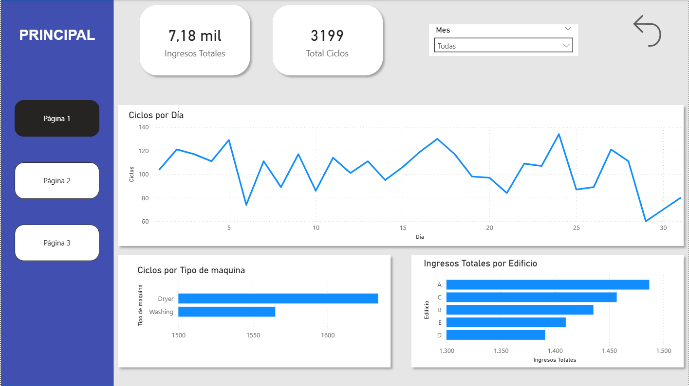
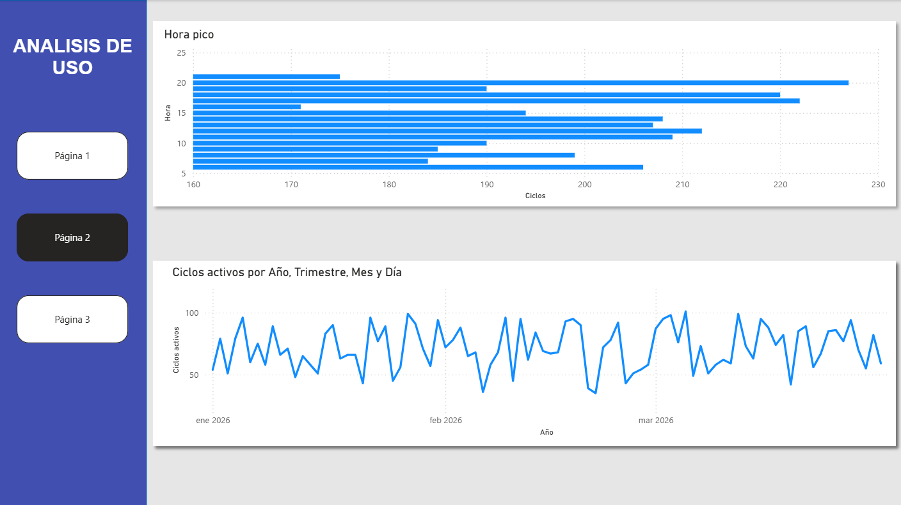
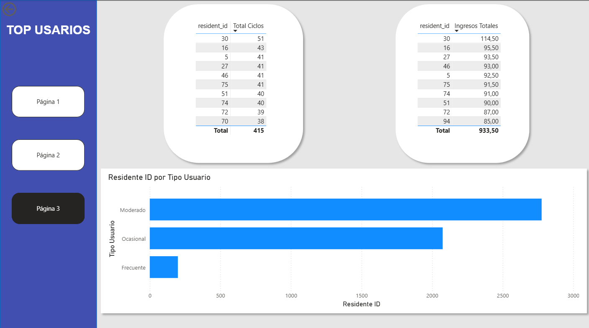

# 🧺 Análisis de Operaciones de Lavanderías (Power BI)

## 📊 Descripción del Proyecto
Este proyecto analiza el uso de lavanderías en un entorno de vivienda multifamiliar, con el objetivo de entender el comportamiento de los usuarios, identificar horas pico y optimizar el rendimiento operativo.

Se simula un escenario real de negocio utilizando SQL para el procesamiento de datos y Power BI para la visualización.

---

## 🎯 Objetivos
- Analizar el número de ciclos e ingresos generados
- Identificar horas pico de uso
- Analizar el comportamiento de los usuarios
- Segmentar usuarios según su nivel de uso
- Detectar oportunidades de mejora operativa

---

## 🧠 Principales Insights
- Las horas pico se concentran en ciertos periodos del día
- Un pequeño grupo de usuarios genera la mayor parte del uso (principio de Pareto)
- Existen usuarios frecuentes, moderados y ocasionales
- Algunas máquinas presentan baja utilización

---

## 🛠 Herramientas Utilizadas
- SQL (procesamiento de datos)
- Power BI (visualización)
- DAX (cálculo de KPIs)

---

## 📁 Estructura del Proyecto
📁 laundry-data-analysis

┣ 📁 data

┃ ┣ usage_cycles.csv

┃ ┣ machines.csv

┃ ┣ residents.csv

┃ ┗ laundries.csv

┣ 📁 dashboard

┃ ┣ 📁 powerbi

┃ ┃ ┗ 📄 PROYECTO LAVANDERIA.pbix

┃ ┣ 📁 images

┃ ┃ ┣📄 KPI.png

┃ ┃ ┣ 📄 ANALISIS_USO.png

┃ ┃ ┗ 📄 TOP_USUARIOS.png

┣ 📁 sql

┃ ┣ hourly_usage_cycles.sql

┗ 📄 README.md

---

## 📊 Datos
El proyecto utiliza múltiples tablas relacionadas:

- **usage_cycles**: registros de uso (inicio, fin, precio)
- **machines**: información de máquinas
- **residents**: usuarios
- **laundries**: ubicaciones

---

## 📈 Funcionalidades del Dashboard
- KPIs principales (ciclos, ingresos, duración)
- Análisis de horas pico
- Top usuarios por uso e ingresos
- Segmentación de usuarios
- Rendimiento de máquinas

---

## 📸 Vista del Dashboard

---

## 🚀 Cómo usar
1. Descargar el archivo `PROYECTO LAVANDERIA.pbix`
2. Abrir en Power BI Desktop
3. Explorar los gráficos y filtros

---

## 💡 Impacto en el Negocio
Este análisis permite:
- Optimizar el uso de las máquinas
- Identificar patrones de consumo
- Mejorar la toma de decisiones operativas

---

## 👤 Autor
Orlando Favian Villanueva Medina
